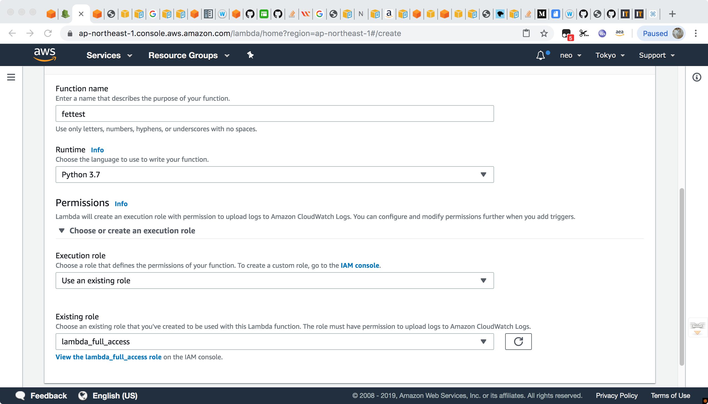
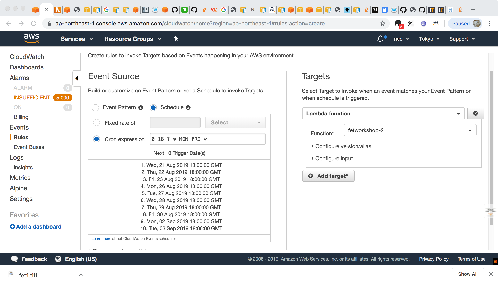
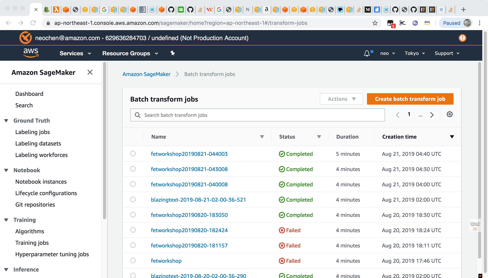

# sagemaker-automation
## lambda function to call boto3 API to create sagemaker batch transform job
1. create a lmabda function with below setting, and click create
    
2. paste code below, you would need to replace the 'bucket', 'prefix' and 'transform_channel' to your own s3 object path and filename

``` Python
import boto3
import os
import time
REGION = boto3.session.Session().region_name
sagemaker = boto3.client('sagemaker')
bucket = 'neochen-fet' # Replace with your own bucket name if needed
prefix = 'blazingtext' #Replace with the prefix under which you want to store the data if needed
transform_channel = 'dev_nolabel.json'

def lambda_handler(event, context):
    try:
        response = sagemaker.create_transform_job(
            TransformJobName='fetworkshop'+time.strftime("%Y%m%d-%H%M%S"),
            ModelName='blazingtext-2019-08-13-06-09-24-102',
            BatchStrategy='MultiRecord',
            TransformInput={
                'DataSource': {
                    'S3DataSource': {
                        'S3DataType': 'S3Prefix',
                        'S3Uri': 's3://{}/{}'.format(bucket, transform_channel)
                    }
                },
                'ContentType': 'application/jsonlines',
                'CompressionType': 'None',
                'SplitType': 'Line'
            },
            TransformOutput={
                'S3OutputPath': 's3://{}/{}/transform/'.format(bucket, prefix),
                'AssembleWith': 'Line'
            },
            TransformResources={
                'InstanceType': 'ml.m4.xlarge',
                'InstanceCount': 1
            }
        )
    except Exception as e:
        print(e)
        print('Unable to create transform job.')
        raise(e)
```
click save

3. click test, fill in event name(we don't need to parse event input for this test) and save, then click test.

## cloudwatch event for scheduled triggering lambda
1. in cloudwatch console, go to event -> rules and click 'create rule'
2. config the schedule event as below, you can refer to cron expression 

click 'configure detail'
3.give it a name and description and click 'save', note that this event will be trigger at the nearest time, instead of the time we click 'save'

## sagemaker console
1. go to sagemaker console -> batch transform to see if the transform job is work as expected


